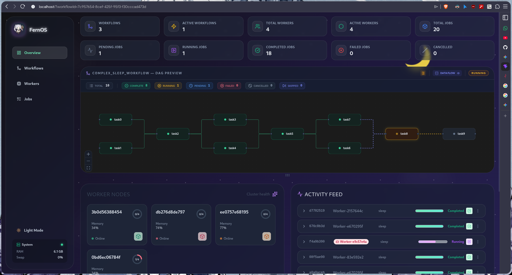
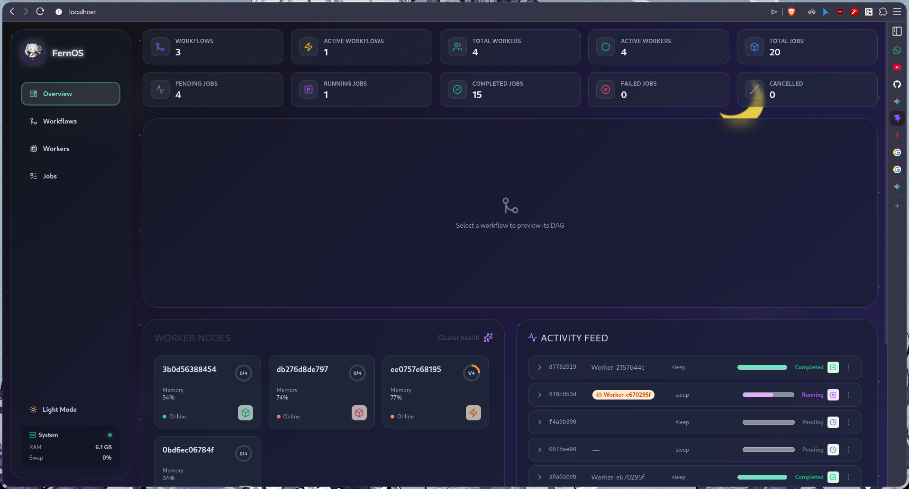

# Main Dashboard

The **Home** view provides an at-a-glance summary of the entire Fern-OS cluster. It is the primary landing page upon logging into the dashboard.

*Figure 1: Main Dashboard with active workflow session.*

## Sidebar & System Health

The left sidebar provides navigation to the four main views: **Overview**, **Workflows**, **Workers**, and **Jobs**.

*   **Theme Toggle**: Switch between Light and Dark mode.
*   **System Monitor**: Located at the bottom of the sidebar, this shows the Manager's local resource usage, including **RAM** and **Swap** utilization.

## Key Metrics Grid

The top section displays real-time statistics for the entire cluster:
*   **Cluster Stats**: Total Workflows, Active Workflows, Total Workers, and Active Workers.
*   **Job Breakdown**: A live count of jobs by state: Pending, Running, Completed, Failed, and Cancelled.

## DAG Preview Panel

The central panel renders the execution graph (DAG) of the selected workflow. 

*   **Workflow Selection**: In the "Empty" state, the dashboard prompts you to select a workflow. Once selected, the graph is rendered dynamically.
*   **Node Visuals**: 
    - **Green Nodes**: Successfully completed tasks.
    - **Yellow/Orange Nodes**: Currently running tasks.
    - **Blue/Grey Nodes**: Pending or scheduled tasks.
*   **Status Badges**: The panel header displays a summary count of nodes by status (Total, Complete, Running, etc.).
*   **Data Flow Toggle**: You can toggle the visibility of "Data Flow" (dashed purple lines) which represent signal dependencies between tasks.
*   **Interactivity**: The panel supports zooming, panning, and automatic layout stabilization.

*Figure 2: Dashboard state when no workflow is selected.*

## Activity Feed & Worker Nodes

### Activity Feed (Right Panel)
A live chronological stream of job status updates. Each entry shows:
*   **Job ID & Type**: The unique ID and the type of job (e.g., `sleep`, `python`).
*   **Worker Assignment**: Which worker node is handling the job.
*   **Progress Indicators**: Animated progress bars for running jobs.
*   **Status Icons**: Clear visual markers (Checkmarks, Play icons, etc.) for current state.

### Worker Nodes (Left Panel)
Cards representing each worker node in the cluster:
*   **Memory Usage**: Real-time stats for each node.
*   **Capacity Circle**: A visual indicator showing `Current Jobs / Max Slots`.
*   **Heartbeat Glow**: A subtle glow indicating the node is "Online" and healthy.
