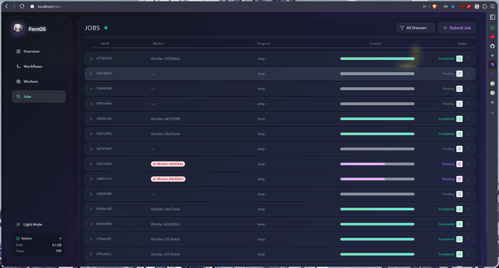

# Jobs History

The **Jobs** view provides a deep dive into every task executed by the engine.

*Figure 4: Jobs history and logs view.*

## Monitoring Executions

Each row in the Jobs table represents a single execution of a task.

*   **Live Updates**: Like the Workflows view, this page features an emerald polling indicator for real-time status tracking.
*   **Progress Indicators**: Each job features an animated progress bar. The bar's color matches the job's status (e.g., purple for running, green for completed).
*   **Status Badges**: High-contrast badges (e.g., COMPLETED, FAILED, RUNNING) provide instant visual feedback on task success.

## Submitting New Jobs

You can manually trigger standalone tasks using the **Submit Job** button.
*   **JSON Payload Editor**: A modal appears with a font-mono text area for defining the job's parameters in JSON format.
*   **Execution**: Clicking **EXECUTE TASK** sends the payload directly to the Manager for scheduling and distribution.

## Logs and Debugging

Clicking on a Job row expands it to reveal execution details:
*   **Job Metadata**: Precise timestamps, assigned worker ID, and parent workflow links.
*   **Console Output**: Capture of all `stdout` and `stderr` streams from the task execution.
