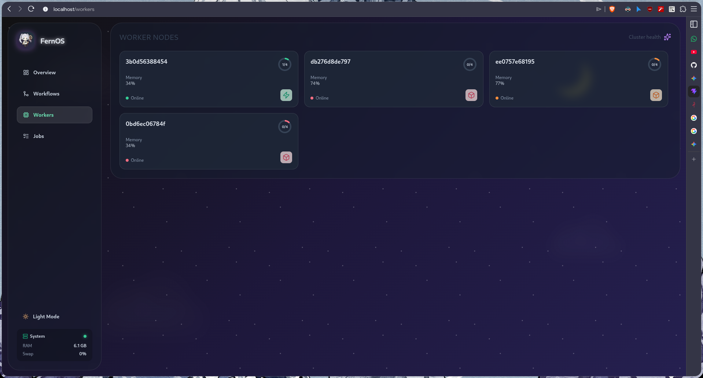

# Worker Nodes

The **Workers** view provides a real-time monitor for all compute resources connected to the Fern-OS cluster.

*Figure 5: Cluster health and worker node monitoring.*

## Monitoring Cluster Health

Each card in the Workers grid represents a physical or virtual machine running the Fern-OS Worker agent.

### Worker Status
*   **Online**: The worker is successfully heartbeating and ready to accept jobs.
*   **Offline**: The worker has missed several heartbeats and is considered unavailable.

### Capacity Management
The circular indicator on each card shows the worker's **Job Capacity**:
*   **Active Count**: The number of jobs currently executing on this node.
*   **Max Capacity**: The total number of parallel tasks the node is configured to handle.

### Resource Utilization
*   **Memory Usage**: A percentage-based indicator of the node's current memory consumption.
*   **Heartbeat Frequency**: Hover over a card to see exactly when the worker last checked in with the Manager.

## Troubleshooting
If a worker appears offline:
1. Ensure the worker process is running on the host machine.
2. Check network connectivity between the worker and the Manager node.
3. Verify the `FERNOS_MANAGER_HOST` and `FERNOS_MANAGER_TCP_PORT` environment variables.
