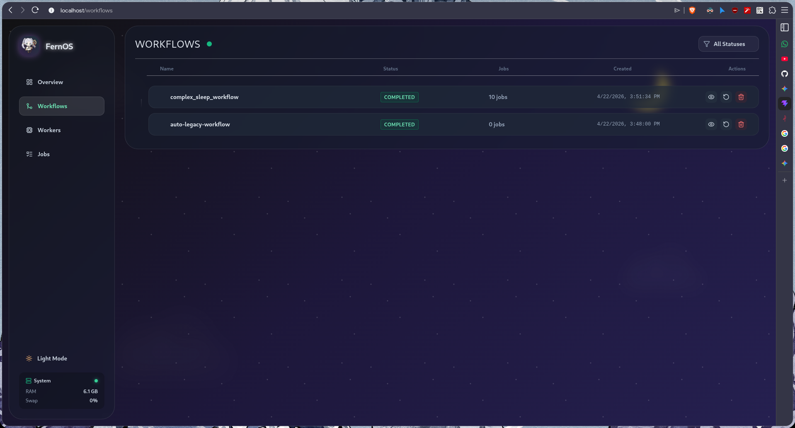

# Workflows Management

The **Workflows** view allows you to manage and trigger workflow definitions across the cluster.

*Figure 3: Workflows management interface.*

## Workflow Definitions

A Workflow in Fern-OS is a Directed Acyclic Graph (DAG) of multiple jobs. On this page, you can see a hierarchical list of all registered workflows.

*   **Live Polling**: The "Emerald Ping" indicator next to the header shows that the dashboard is actively polling the Manager for real-time status updates.
*   **Workflow Hierarchies**: Individual rows use connector lines to visually group related sub-tasks or grouped workflows.
*   **Search and Filters**: A status filter allows you to narrow down the list by state (Draft, Running, Paused, etc.).

## Workflow Actions

Each workflow row provides a set of context-sensitive actions:
*   **View DAG**: Opens the Home dashboard with this workflow's graph rendered.
*   **Execute / Resume**: Starts a new run or resumes a paused workflow.
*   **Pause**: Temporarily halts execution.
*   **Reset**: Clears execution state and prepares for a fresh run.
*   **Delete**: Removes the workflow definition from the system.

## State Indicators

Workflows can be in several states:
*   **DRAFT**: Initial state, not yet ready for execution.
*   **RUNNING**: At least one job is currently executing.
*   **COMPLETED**: All jobs in the DAG finished successfully.
*   **FAILED**: One or more critical jobs failed.
*   **PAUSED**: Execution has been manually suspended.
