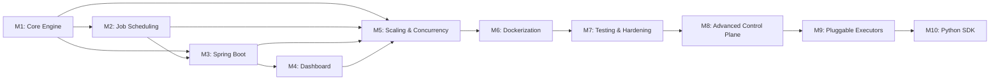

# 🗺️ Project Roadmap — Distributed Job Orchestration Platform

> **37 issues** across **7 milestones** · Estimated **32–40 working days** total

---

## Milestone Overview

| # | Milestone | Issues | Estimate | Dependencies |
|---|-----------|--------|----------|--------------|
| **1** | [Core Engine — TCP & Workers](milestone-1-core-engine/details.md) | #001–#005 (5) | 5–7 days | None |
| **2** | [Job Scheduling & Fault Tolerance](milestone-2-job-scheduling-fault-tolerance/details.md) | #006–#010 (5) | 4–5 days | M1 |
| **3** | [Spring Boot Management Plane](milestone-3-spring-boot-management-plane/details.md) | #011–#019 (9) | 8–9 days | M1, M2 |
| **4** | [Observability Dashboard (TypeScript)](milestone-4-observability-dashboard/details.md) | #020–#024 (5) | 4–5 days | M3 |
| **5** | [Scaling & Concurrency](milestone-5-scaling-concurrency/details.md) | #025–#028 (4) | 4–5 days | M1–M4 |
| **6** | [Dockerization & DevOps](milestone-6-dockerization-devops/details.md) | #029–#032 (4) | 3–4 days | M1–M5 |
| **7** | [Testing & Production Hardening](milestone-7-testing-hardening/details.md) | #033–#037 (5) | 4–5 days | M1–M6 |
| **8** | [Advanced Control Plane](milestone-8-advanced-control-plane/details.md) | #038–#041 (4) | 5–7 days | M1–M7 |
| **9** | [Pluggable Executors & Advanced Job Types](milestone-9-pluggable-executors-advanced-job-types/details.md) | #042–#048 (7) | 6–8 days | M1–M8 |
| **10** | [Python SDK & API Module](milestone-10-python-sdk-api-module/details.md) | #049–#054 (6) | 6–8 days | M1–M9 |

---

## Dependency Graph

---

## Issue Index

### Milestone 1 — Core Engine
| Issue | Title | Priority | Estimate |
|-------|-------|----------|----------|
| [#001](milestone-1-core-engine/issue-001-project-scaffold.md) | Initialize Multi-Module Project Scaffold | 🔴 High | 0.5d |
| [#002](milestone-1-core-engine/issue-002-binary-protocol-codec.md) | Custom Binary Protocol Encoder/Decoder | 🔴 High | 1d |
| [#003](milestone-1-core-engine/issue-003-manager-server.md) | Manager Server with Virtual Threads | 🔴 High | 1.5d |
| [#004](milestone-1-core-engine/issue-004-worker-client.md) | Worker Client with Registration | 🔴 High | 1d |
| [#005](milestone-1-core-engine/issue-005-heartbeat-mechanism.md) | Heartbeat & Dead Worker Detection | 🔴 High | 1d |

### Milestone 2 — Job Scheduling & Fault Tolerance
| Issue | Title | Priority | Estimate |
|-------|-------|----------|----------|
| [#006](milestone-2-job-scheduling-fault-tolerance/issue-006-job-model-state-machine.md) | Job Model & State Machine | 🔴 High | 0.5d |
| [#007](milestone-2-job-scheduling-fault-tolerance/issue-007-job-queue-scheduler.md) | Job Queue & Scheduler | 🔴 High | 1d |
| [#008](milestone-2-job-scheduling-fault-tolerance/issue-008-worker-job-execution.md) | Worker Job Execution & Result Reporting | 🔴 High | 1d |
| [#009](milestone-2-job-scheduling-fault-tolerance/issue-009-result-handling.md) | Manager Result Handling & Job Completion | 🔴 High | 0.5d |
| [#010](milestone-2-job-scheduling-fault-tolerance/issue-010-crash-recovery.md) | Crash Recovery & Job Re-Queuing | 🔥 Critical | 1d |

### Milestone 3 — Spring Boot Management Plane
| Issue | Title | Priority | Estimate |
|-------|-------|----------|----------|
| [#011](milestone-3-spring-boot-management-plane/issue-011-spring-boot-refactor.md) | Refactor Manager to Spring Boot Service | 🔴 High | 1d |
| [#012](milestone-3-spring-boot-management-plane/issue-012-jpa-entities-repositories.md) | JPA Entities, Repositories & Schema | 🔴 High | 1d |
| [#013](milestone-3-spring-boot-management-plane/issue-013-rest-api-controllers.md) | REST API Controllers (Jobs & Workers) | 🔴 High | 1d |
| [#014](milestone-3-spring-boot-management-plane/issue-014-engine-db-sync.md) | Engine ↔ Database Event Sync | 🔴 High | 1d |
| [#015](milestone-3-spring-boot-management-plane/issue-015-startup-recovery.md) | Manager Startup Recovery from DB | 🔥 Critical | 0.5d |
| [#016](milestone-3-spring-boot-management-plane/issue-016-worker-registry-optimisation.md) | Worker Registry Optimisation | 🟡 Medium | 0.5d |
| [#017](milestone-3-spring-boot-management-plane/issue-017-network-hardening.md) | Worker Client & Manager Queue Hardening | 🟡 Medium | 0.5d |
| [#018](milestone-3-spring-boot-management-plane/issue-018-worker-authentication.md) | Worker Authentication & Security | 🟡 Medium | 0.5d |
| [#019](milestone-3-spring-boot-management-plane/issue-019-pluggable-task-executor.md) | Pluggable Task Executor Architecture | 🔴 High | 1.5d |

### Milestone 4 — Observability Dashboard
| Issue | Title | Priority | Estimate |
|-------|-------|----------|----------|
| [#020](milestone-4-observability-dashboard/issue-020-scaffold-frontend.md) | Scaffold React + TypeScript Project | 🔴 High | 0.5d |
| [#021](milestone-4-observability-dashboard/issue-021-api-client-service.md) | Typed API Client Service | 🔴 High | 0.5d |
| [#022](milestone-4-observability-dashboard/issue-022-workers-view.md) | Workers View: Live Worker Grid | 🔴 High | 1d |
| [#023](milestone-4-observability-dashboard/issue-023-jobs-view.md) | Jobs View: Filterable Job List | 🔴 High | 1d |
| [#024](milestone-4-observability-dashboard/issue-024-dashboard-overview.md) | Dashboard Overview & Navigation Shell | 🟡 Medium | 1d |

### Milestone 5 — Scaling & Concurrency
| Issue | Title | Priority | Estimate |
|-------|-------|----------|----------|
| [#025](milestone-5-scaling-concurrency/issue-025-async-worker-client.md) | Asynchronous Worker Execution | 🔴 High | 1d |
| [#026](milestone-5-scaling-concurrency/issue-026-concurrent-job-assignments.md) | Concurrent Job Assignments per Worker | 🔴 High | 1d |
| [#027](milestone-5-scaling-concurrency/issue-027-cancel-job-command.md) | Manager-Initiated Cancel Job Command | 🔴 High | 1d |
| [#028](milestone-5-scaling-concurrency/issue-028-resource-aware-scheduler.md) | Resource-Aware Scheduler | 🟡 Medium | 1.5d |

### Milestone 6 — Dockerization & DevOps
| Issue | Title | Priority | Estimate |
|-------|-------|----------|----------|
| [#029](milestone-6-dockerization-devops/issue-029-manager-dockerfile.md) | Dockerfile for Spring Boot Manager | 🔴 High | 0.5d |
| [#030](milestone-6-dockerization-devops/issue-030-worker-dockerfile.md) | Dockerfile for Java Worker | 🔴 High | 0.5d |
| [#031](milestone-6-dockerization-devops/issue-031-dashboard-dockerfile.md) | Dockerfile for Dashboard (Nginx) | 🔴 High | 0.5d |
| [#032](milestone-6-dockerization-devops/issue-032-docker-compose.md) | Docker Compose Orchestration | 🔥 Critical | 1d |

### Milestone 7 — Testing & Hardening
| Issue | Title | Priority | Estimate |
|-------|-------|----------|----------|
| [#033](milestone-7-testing-hardening/issue-033-structured-logging.md) | Structured Logging with MDC | 🔴 High | 0.5d |
| [#034](milestone-7-testing-hardening/issue-034-integration-tests.md) | Integration Test Suite | 🔴 High | 1.5d |
| [#035](milestone-7-testing-hardening/issue-035-chaos-testing.md) | Chaos Testing Harness | 🔥 Critical | 1d |
| [#036](milestone-7-testing-hardening/issue-036-metrics-endpoint.md) | Metrics Endpoint (Actuator) | 🟡 Medium | 0.5d |
| [#037](milestone-7-testing-hardening/issue-037-documentation.md) | Project Documentation & Architecture | 🟡 Medium | 1d |

### Milestone 8 — Advanced Control Plane
| Issue | Title | Priority | Estimate |
|-------|-------|----------|----------|
| [#038](milestone-8-advanced-control-plane/issue-038-dag-visualizer.md) | DAG Visualizer | 🔴 High | 1.5d |
| [#039](milestone-8-advanced-control-plane/issue-039-visual-job-scheduling-management.md) | Visual Job Scheduling & Management | 🔴 High | 1.5d |
| [#040](milestone-8-advanced-control-plane/issue-040-full-system-controls.md) | Full System Controls | 🟡 Medium | 1d |
| [#041](milestone-8-advanced-control-plane/issue-041-ui-refinements.md) | UI Refinements (See and Fix) | 🟡 Medium | 1d |

### Milestone 9 — Pluggable Executors & Advanced Job Types
| Issue | Title | Priority | Estimate |
|-------|-------|----------|----------|
| [#042](milestone-9-pluggable-executors-advanced-job-types/issue-042-pluggable-executor-spi.md) | Pluggable Task Executor SPI | 🔴 High | 1.5d |
| [#043](milestone-9-pluggable-executors-advanced-job-types/issue-043-python-operator.md) | Python Task Operator | 🔴 High | 1d |
| [#044](milestone-9-pluggable-executors-advanced-job-types/issue-044-http-api-operator.md) | HTTP/API Operator | 🔴 High | 1d |
| [#045](milestone-9-pluggable-executors-advanced-job-types/issue-045-sql-database-operator.md) | SQL/Database Operator | 🔴 High | 1d |
| [#046](milestone-9-pluggable-executors-advanced-job-types/issue-046-docker-kubernetes-operator.md) | Docker/Kubernetes Operator | 🟡 Medium | 1d |
| [#047](milestone-9-pluggable-executors-advanced-job-types/issue-047-sensor-trigger-operator.md) | Sensor/Trigger Operator | 🟡 Medium | 1d |
| [#048](milestone-9-pluggable-executors-advanced-job-types/issue-048-result-passing-xcoms.md) | Result Passing (XComs) Infrastructure | 🔴 High | 1d |

### Milestone 10 — Python SDK & API Module
| Issue | Title | Priority | Estimate |
|-------|-------|----------|----------|
| [#049](milestone-10-python-sdk-api-module/issue-049-pure-text-log-api.md) | Pure Text Log API Endpoint | 🔴 High | 0.5d |
| [#050](milestone-10-python-sdk-api-module/issue-050-fluent-python-workflow-api.md) | Fluent Python Workflow Definition API | 🔴 High | 1.5d |
| [#051](milestone-10-python-sdk-api-module/issue-051-python-execution-client.md) | Python SDK Workflow Execution Client | 🔴 High | 1d |
| [#052](milestone-10-python-sdk-api-module/issue-052-integrated-minio-xcom-utils.md) | Integrated MinIO & XCom Utilities | 🔴 High | 1d |
| [#053](milestone-10-python-sdk-api-module/issue-053-sdk-developer-experience.md) | Python SDK CLI & Developer Tooling | 🟡 Medium | 1d |
| [#054](milestone-10-python-sdk-api-module/issue-054-script-preprocessor-module-injection.md) | Script Preprocessor & Module Injection | 🔴 High | 1d |
